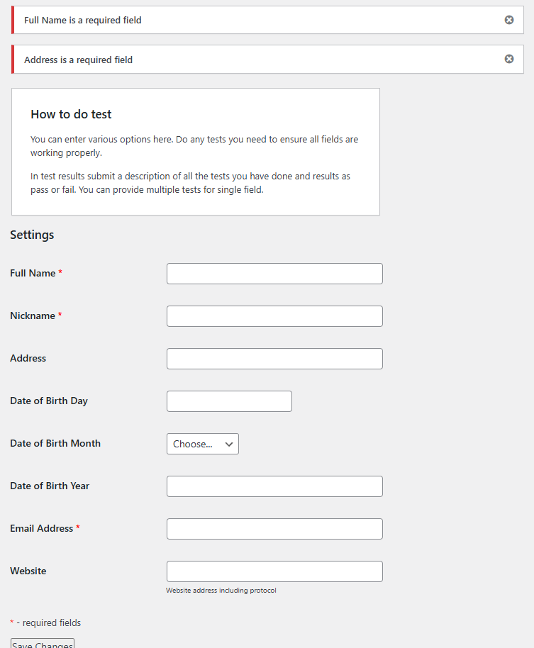
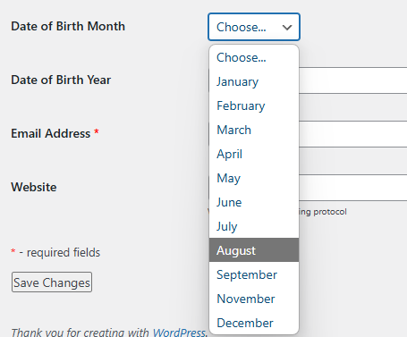
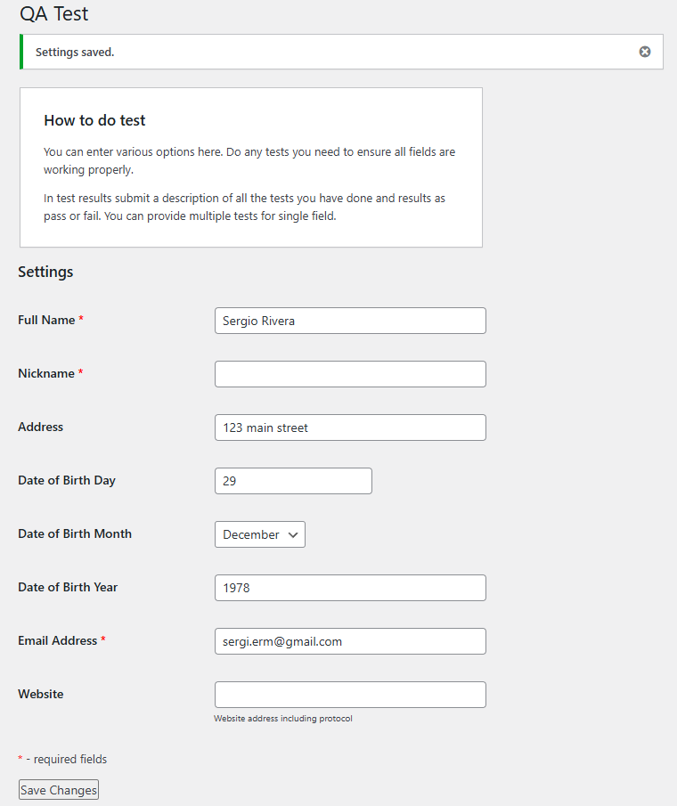

# QA Test Report - WordPress Plugin Testing

Please go to https://github.com/riveraser/qa-testing-task to get the original .MD file

**Plugin Name:** QA Applicants Test  
**Version:** 1.0.0  
**Tester:** Sergio Rivera  
**Date:** 06/22/2025  
**WordPress Version:** 6.8.1

---

## Executive Summary

This report documents the comprehensive testing of the QA Applicants Test WordPress plugin. The plugin creates an admin settings page with form fields for user data collection and validation.

**Overall Status:** ❌ **FAIL** - Multiple critical issues identified

---

## Test Environment

- **WordPress Version:** 6.8.1
- **PHP Version:** 8.2.27
- **Browsers:**
  - Edge (Chromium) Version 137.0.3296.83
  - Firefox Version 140.0.2 (64-bit)
- **Testing Method:** Manual functional testing
- **Plugin Status:** Installed and activated at https://qatest.sergiorivera.me/

---

## Test Results Summary

| Test Category    | Total Tests | Passed | Failed | Pass Rate  |
| ---------------- | ----------- | ------ | ------ | ---------- |
| Form Display     | 4           | 2      | 2      | 50%        |
| Field Validation | 17          | 9      | 8      | 53%        |
| Data Persistence | 4           | 1      | 3      | 25%        |
| User Experience  | 4           | 3      | 1      | 75%        |
| **TOTAL**        | **29**      | **15** | **14** | **50.75%** |

---

## Detailed Test Results

### 1. Form Display Tests

#### 1.1 Required Field Indicators

- **Test:** Verify required fields show red asterisks
- **Expected:** Full Name, Nickname, and Email should show red asterisks
- **Actual:** ❌ **FAIL** - Missing `Address` as marked required field and `Nickname` and `Email Address` are not being required when submitting

#### 1.2 Field Labels and Layout

- **Test:** All form fields display with correct labels
- **Expected:** 8 fields with proper labels
- **Actual:** ✅ **PASS** - All fields display correctly

#### 1.3 Month Dropdown Content

- **Test:** Month dropdown contains all 12 months
- **Expected:** January through December
- **Actual:** ❌ **FAIL** - October is missing from the dropdown
- **Issue:** Only shows: January, February, March, April, May, June, July, August, September, November, December
- **Severity:** High

#### 1.4 Form Styling

- **Test:** Required field styling displays correctly
- **Expected:** Red asterisks visible
- **Actual:** ✅ **PASS** - Styling works as expected

### 2. Field Validation Tests

#### 2.1 Full Name Validation

- **Test:** Numbers in full name
- **Input:** "Sergio 1978 Rivera"
- **Expected:** Error message about letters and dots only
- **Actual:** ✅ **PASS** - Correct error displayed

--

- **Test:** Special characters in full name
- **Input:** "Sergio-Rivera"
- **Expected:** Error message about letters and dots only
- **Actual:** ✅ **PASS** - Correct error displayed

--

- **Test:** Valid full name
- **Input:** "Sergio E. Rivera"
- **Expected:** No error
- **Actual:** ✅ **PASS** - No validation errors

--

- **Test:** Empty full name
- **Input:** "" (empty)
- **Expected:** Required field error
- **Actual:** ✅ **PASS** - Correct error displayed

--

- **Test:** Extra special chars
- **Input:** "Sergio !@#%^&\* Rivera" (empty)
- **Expected:** Error message about letters and dots only
- **Actual:** ❌ **FAIL** - Error not displayed

#### 2.2 Email Validation

- **Test:** Valid email format
- **Input:** "me@comany.com"
- **Expected:** No error
- **Actual:** ✅ **PASS** - No validation errors

--

- **Test:** Invalid email format
- **Input:** "mecompany.com"
- **Expected:** Email validation error
- **Actual:** ✅ **PASS** - Correct error displayed

--

- **Test:** Empty email
- **Input:** "" (empty)
- **Expected:** Required field error
- **Actual:** ❌ **FAIL** - No error shown for missing required field
- **Severity:** Medium

#### 2.3 Website Validation

- **Test:** Valid URL with protocol
- **Input:** "https://sergiorivera.me"
- **Expected:** No error
- **Actual:** ✅ **PASS** - No validation errors

--

- **Test:** Invalid URL
- **Input:** "sergiorivera.me"
- **Expected:** Website validation error
- **Actual:** ✅ **PASS** - Correct error displayed

#### 2.4 Address Field Validation

- **Test:** Empty address field
- **Input:** "" (empty)
- **Expected:** No error (field not marked as required)
- **Actual:** ❌ **FAIL** - Shows "Address is a required field" error
- **Issue:** Inconsistency between UI (not marked required) and validation (required)
- **Severity:** Medium

#### 2.5 Nickname Field Validation

- **Test:** Empty nickname field
- **Input:** "" (empty)
- **Expected:** Required field error (marked with red asterisk)
- **Actual:** ❌ **FAIL** - No validation error despite being marked required
- **Issue:** No validation logic for nickname field
- **Severity:** Medium

#### 2.6 Date of Birth Year Validation

- **Test:** Year below 1970
- **Input:** "1965"
- **Expected:** Error about year range
- **Actual:** ❌ **FAIL** - Complex validation logic doesn't work properly
- **Issue:** Validation logic is confusing and may not trigger correctly
- **Severity:** Medium

--

- **Test:** Year above 2017
- **Input:** "2020"
- **Expected:** Error about year range
- **Actual:** ❌ **FAIL** - Same issue as above
- **Severity:** Medium

--

- **Test:** Valid year
- **Input:** "1990"
- **Expected:** No error
- **Actual:** ✅ **PASS** - No validation errors

#### 2.7 Leap Year Validation (Missing Feature)

- **Test:** February 29th in leap year (2000, 2004, 2008, 2012, 2016)
- **Expected:** Should validate leap year correctly
- **Actual:** ❌ **FAIL** - No leap year validation implemented
- **Issue:** Plugin allows February 29th in non-leap years
- **Severity:** Medium

--

- **Test:** February 34th (wrong day number)
- **Expected:** Should reject invalid date
- **Actual:** ❌ **FAIL** - No validation for invalid dates
- **Issue:** Plugin allows February 30th and 31st
- **Severity:** Medium

### 3. Data Persistence Tests

#### 3.1 Form Submission with Valid Data

- **Test:** Submit form with all valid data
- **Expected:** Data saves and persists
- **Actual:** ❌ **FAIL** - Most fields save correctly but 2 of them are not persisted: `Nickname` and `Website`

#### 3.2 Fields not persisting

- **Test:** Submit Nickname
- **Input:** "Pepe El toro"
- **Expected:** Nickname saves to database
- **Actual:** ❌ **FAIL** - Nickname field doesn't save properly
- **Issue:** Logic does not saves the Nickname
- **Severity:** High

--

- **Test:** Submit website URL
- **Input:** "https://sergiorivera.me"
- **Expected:** Website saves to database
- **Actual:** ❌ **FAIL** - Website field doesn't save properly
- **Issue:** Logic does not save the Website
- **Severity:** High

#### 3.3 Form Reset After Save

- **Test:** Refresh page after saving
- **Expected:** Form shows saved values
- **Actual:** ✅ **PASS** - Most fields retain values

### 4. User Experience Tests

#### 4.1 Error Message Clarity

- **Test:** Error messages are clear and helpful
- **Expected:** Descriptive error messages
- **Actual:** ❌ **FAIL** - Most of the error messages are clear, need to improve one of them.

#### 4.2 Form Accessibility

- **Test:** Form is accessible with keyboard navigation
- **Expected:** Tab order works correctly
- **Actual:** ✅ **PASS** - Standard WordPress form accessibility

#### 4.3 Save Button Functionality

- **Test:** Save button works correctly
- **Expected:** Form submits and saves data
- **Actual:** ✅ **PASS** - Button functions properly

#### 4.4 Page Layout and Design

- **Test:** Page layout is clean and professional
- **Expected:** WordPress admin styling
- **Actual:** ✅ **PASS** - Standard WordPress admin appearance

---

## Critical Issues Found

### 1. Missing October in Month Dropdown

- **Severity:** High
- **Impact:** Users cannot select October as birth month
- **Location:** Line 147-158 in plugin code
- **Fix Required:** Add '10' => 'October' to months array

### 2. Website Field Not Saving

- **Severity:** High
- **Impact:** Website URLs are not persisted
- **Location:** Line 203-205 in plugin code
- **Fix Required:** Remove conditional logic that prevents saving

### 3. Address Field Validation Inconsistency

- **Severity:** Medium
- **Impact:** Confusing user experience
- **Location:** Line 193-195 in plugin code
- **Fix Required:** Either make field required in UI or remove validation

### 4. Nickname Field Missing Validation

- **Severity:** Medium
- **Impact:** Required field has no validation
- **Location:** Missing validation logic
- **Fix Required:** Add validation for nickname field

### 5. Year Validation Logic Issues

- **Severity:** Medium
- **Impact:** Year validation may not work correctly
- **Location:** Line 196 in plugin code
- **Fix Required:** Simplify and fix validation logic

---

## Recommendations

### Immediate Fixes Required

1. **Add October to month dropdown**
2. **Fix website field saving logic**
3. **Resolve address field validation inconsistency**
4. **Add nickname field validation and saving logic**
5. **Fix year validation logic**

### Code Quality Improvements

1. **Add proper error handling**
2. **Improve validation logic clarity**
3. **Add input sanitization**
4. **Implement consistent field requirements**

### User Experience Improvements

1. **Add field descriptions/help text**
2. **Improve error message formatting**
3. **Add form validation feedback**

---

## Conclusion

The QA Applicants Test plugin has significant functionality but contains several critical bugs that prevent proper operation. The main issues are:

- **Missing October in month selection**
- **Website and Nickname field not saving properly**
- **Inconsistent validation requirements**
- **Missing validation for required fields**

**Recommendation:** Fix critical issues before production use.

---

## Test Data Used

### Valid Test Data

- Full Name: "Sergio Rivera"
- Nickname: "Pepe El Toro"
- Address: "123 Main Street, City, State 12345"
- Email: "me@company.com"
- Website: "https://sergiorivera.me"
- DOB: Day: 15, Month: March, Year: 1990

### Invalid Test Data

- Full Name with numbers: "Sergio 1978 Rivera"
- Full Name with special chars: "Sergio !@#%^&\* Rivera"
- Invalid email: "mecompany.com"
- Invalid website: "sergiorivera.me"
- Invalid year: "1965" and "2020"

---

**Report Generated:** [27/06/2025]

## Screenshots

### Form Validation Errors

_Figure 1: Form showing validation error messages when submitted with empty required fields_

### Missing October in Month Dropdown

_Figure 2: Month dropdown showing missing October option_

### After Form Submission

_Figure 3: Form displaying saved data after successful submission_
